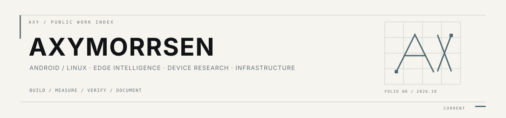

  

  systems work, kept explicit about provenance, validation and unfinished edges

I work across Android/Linux systems, edge inference, device integration and developer infrastructure. Public repositories are treated as engineering records rather than feature brochures: upstream work stays attributed, experimental results stay labeled, and a successful build is not described as device validation.

## 01 / primary work

<table>
<tr>
<td width="50%" valign="top">
EDGE AUDIO / ML 
<strong><a href="https://github.com/Zhanfg/Voxera">Voxera</a></strong> 
Compact offline semantic-prosodic voice conversion. The staged native path, prosody/semantic sidecars and test suite are present; current M4 work defines and verifies the ONNX deployment-bundle contract.  
<code>pre-alpha · M4</code>
</td>
<td width="50%" valign="top">
ANDROID AGENT RUNTIME 
<strong><a href="https://github.com/Zhanfg/nova-agent">Nova</a></strong> 
Android autonomous-agent runtime with provider routing, tool schemas, browser/device/accessibility paths, bounded root execution, skills and memory plumbing.  
<code>Android · agent runtime</code>
</td>
</tr>
<tr>
<td width="50%" valign="top">
KERNELPATCH TOOLING 
<strong><a href="https://github.com/Zhanfg/PatchNest">PatchNest</a></strong> 
Consolidated KernelPatch user-space surface covering CLI, module/WebUI and KPM paths, with path-specific CI and validation contracts.  
<code>CLI · module · KPM</code>
</td>
<td width="50%" valign="top">
ANDROID NETWORKING 
<strong><a href="https://github.com/Zhanfg/TCP_Optimiser_RS">TCP Optimiser RS</a></strong> 
Rust-based Android congestion-control module with interface-aware policies, runtime verification, statistics, recovery logic and a responsive WebUI.  
<code>v3.0.0 · Rust</code>
</td>
</tr>
<tr>
<td width="50%" valign="top">
CAMERA RESEARCH 
<strong><a href="https://github.com/Zhanfg/OnePlus13-CameraBoost">OnePlus13 CameraBoost</a></strong> 
Clean-room OPlus camera capability research with an official-source feature catalog, compatibility data, device probes and guarded 10-bit still gate experiments.  
<code>research · validation-first</code>
</td>
<td width="50%" valign="top">
DEVELOPER INFRASTRUCTURE 
<strong><a href="https://github.com/Zhanfg/axymorrsen-infra-mcp">Axymorrsen Infra MCP</a></strong> 
MCP gateway with provider adapters, scoped OAuth/JWT authorization, safety modes, audit metadata, remote/stdio transport bridging and release verification.  
<code>MCP · security boundary</code>
</td>
</tr>
</table>

## 02 / maintained downstreams

These are explicitly downstream works, not presented as original upstream ownership.

| Repository | Upstream boundary | Current local surface |
| --- | --- | --- |
| [Android-DataBackup](https://github.com/Zhanfg/Android-DataBackup) | fork of <code>XayahSuSuSu/Android-DataBackup</code> | backup/restore architecture work and Rustic restore path |
| [Miband-OPlusBridge](https://github.com/Zhanfg/Miband-OPlusBridge) | fork of <code>MiaM1ku/Miband-OPlusBridge</code> | ColorOS / OPPO Health integration; Mi Band 11 path is device-verified |
| [RootlessViPER4Android](https://github.com/Zhanfg/RootlessViPER4Android) | fork of <code>alienware377/RootlessViPER4Android</code> | rootless ViPER-style DSP work on the downstream audio branch |
| [Bettbox](https://github.com/Zhanfg/Bettbox) | fork of <code>appshubcc/Bettbox</code> | maintained network-client downstream |

## 03 / workspaces

<table>
<tr>
<td><strong><a href="https://github.com/ZhanfgBuild">ZhanfgBuild</a></strong> source bases, CI/release plumbing and tracked upstreams</td>
<td><strong><a href="https://github.com/limbweave-lab">LimbWeave</a></strong> modular wearable mechatronics engineering</td>
</tr>
<tr>
<td><strong><a href="https://github.com/nullweave-lab">nullweave</a></strong> runtime-integrity and proof-systems research namespace</td>
<td><strong><a href="https://github.com/yuezhou-build">yuezhou-build</a></strong> upstream tracking, maintenance and isolated experiments</td>
</tr>
</table>

  <a href="https://axymorrsen.cc">axymorrsen.cc</a> · 中文交流 / English documentation

